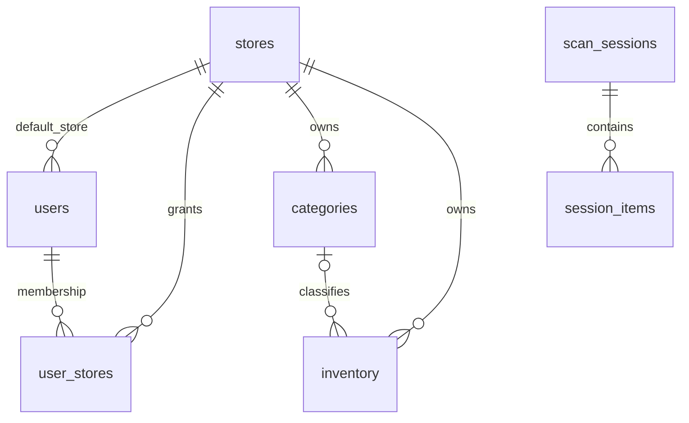

# OptiCapture database schema

The complete SQLite DDL for the current app is in [database-schema.sql](database-schema.sql). It contains all 9 application tables and 15 named indexes, including unique and partial indexes. The SQL is generated from a fresh in-memory database after `src/server/db.ts` has applied all current migrations. It does not include seed data or planned integration tables.

## Downloadable ERDs

| Scope | One-page quick reference | Detailed reference |
| --- | --- | --- |
| Current database | [Quick ERD (SVG)](opticapture-erd-quick.svg) | [Detailed ERD (SVG)](opticapture-erd.svg) |

Teal denotes entities, red arrows denote SQL foreign keys, and pale red panels hold key notes.

The [current relationship and rules declaration](DATABASE_RELATIONSHIPS_CURRENT.md) describes what the app actually enforces today.

The current detailed ERD is zoomable and shows every column's SQLite type, nullability, default, primary/foreign key markers, each table's indexes and unique constraints, the seven enforced foreign keys with optionality, and app-level associations that have no database constraint.

The ERD marks `INTEGER PRIMARY KEY` columns as non-null because they alias the SQLite row ID. Other nullability labels follow the column declaration; SQLite can allow `NULL` in a non-integer primary key unless it is explicitly `NOT NULL`.

`src/server/db.ts` remains the source of truth for database creation and upgrades. `schema_migrations` records applied versions; the current code has migrations 1 through 19. Do not run the snapshot as a migration against an existing database.

Timestamps are stored as UTC text in the `CURRENT_TIMESTAMP` form, `YYYY-MM-DD HH:MM:SS`; `session_items.scanned_at` and `updated_at` add milliseconds. Values carry no zone suffix and must always be read as UTC. Exported files use ISO 8601 UTC with `Z`. The integration proposal enforces the seconds form with a `CHECK` on every timestamp column.

## Tables

| Table | Purpose |
| --- | --- |
| `stores` | Store/tenant profile, status, and login code |
| `users` | Local and OAuth accounts, default store, lockout and token state |
| `user_stores` | Per-store user access and role |
| `categories` | Store-scoped catalog categories |
| `inventory` | Store-scoped catalog and quantity records, including external identifiers |
| `scan_sessions` | Scan/count session status, OTP, expiration, and label |
| `session_items` | Scanned items staged within a session, including device and lookup metadata |
| `logs` | Store-scoped audit entries |
| `schema_migrations` | Applied database migration versions |

## Relationships and constraints



These diagram links are enforced by foreign keys. `scan_sessions.user_id`, `scan_sessions.store_id`, `logs.user_id`, and `logs.store_id` are associations used by the app but currently have no foreign key constraints. There are no cascading foreign key actions in the current schema.

Store codes are unique. Usernames are unique per default store, and OAuth provider/ID pairs are unique when a provider is present. Category names and inventory UPCs are unique per store. Nonempty inventory item numbers are unique per store; nonempty external item IDs are unique for each external system and store. SQLite allows multiple `NULL` values in these unique keys.

The app enables foreign keys, WAL mode, and a 5-second busy timeout on its database connection. Audit logs older than 90 days are pruned at startup and daily.

## Regenerate and verify

```sh
node --import tsx scripts/export-db-schema.mjs
node --import tsx scripts/export-db-schema.mjs --check
node scripts/export-erd.mjs
node scripts/export-erd.mjs --check
```

The exporter only uses in-memory databases and validates that the SQL can create an empty SQLite database.
